## About this presentation

::: callout-note
This report was generated using AI under general human direction. The contents have been reviewed and validated by Evan Krause, Aquatic biologist I on 2026-09-11.
:::

## Temperature

::::: columns
::: {.column width="50%"}
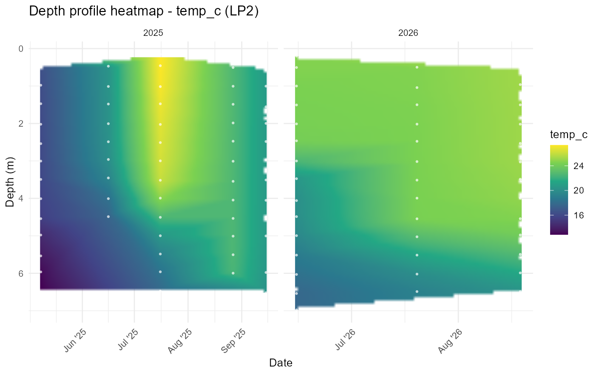
:::

::: {.column width="50%"}
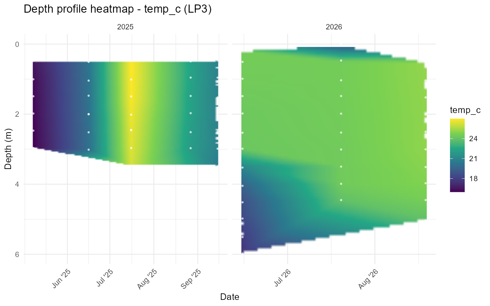
:::
:::::

## Dissolved oxygen — depth profile

::::: columns
::: {.column width="50%"}
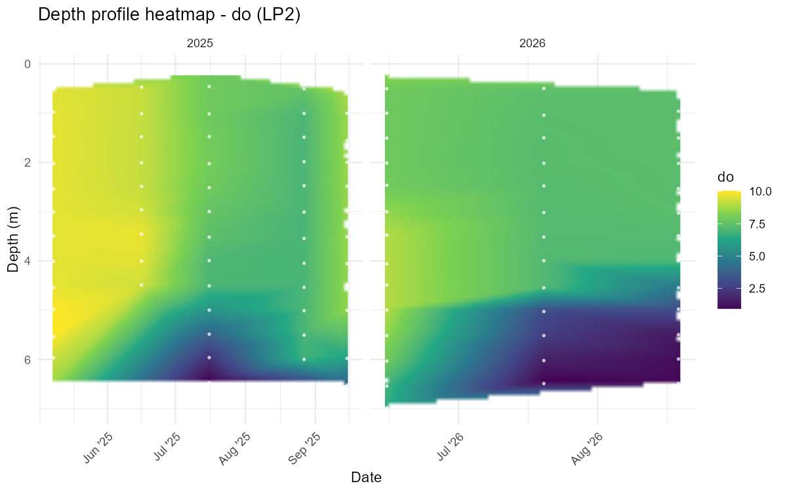
:::

::: {.column width="50%"}
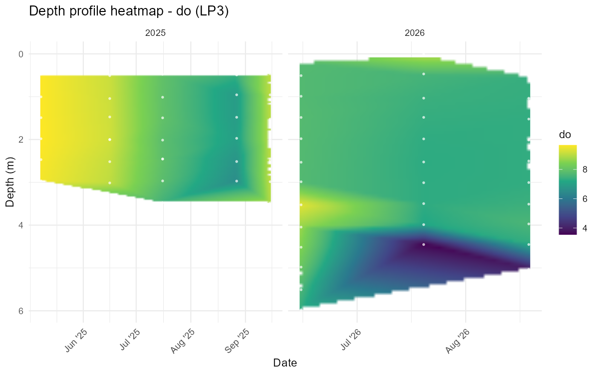
:::
:::::

## Dissolved oxygen — summary

::::: columns
::: {.column width="50%"}
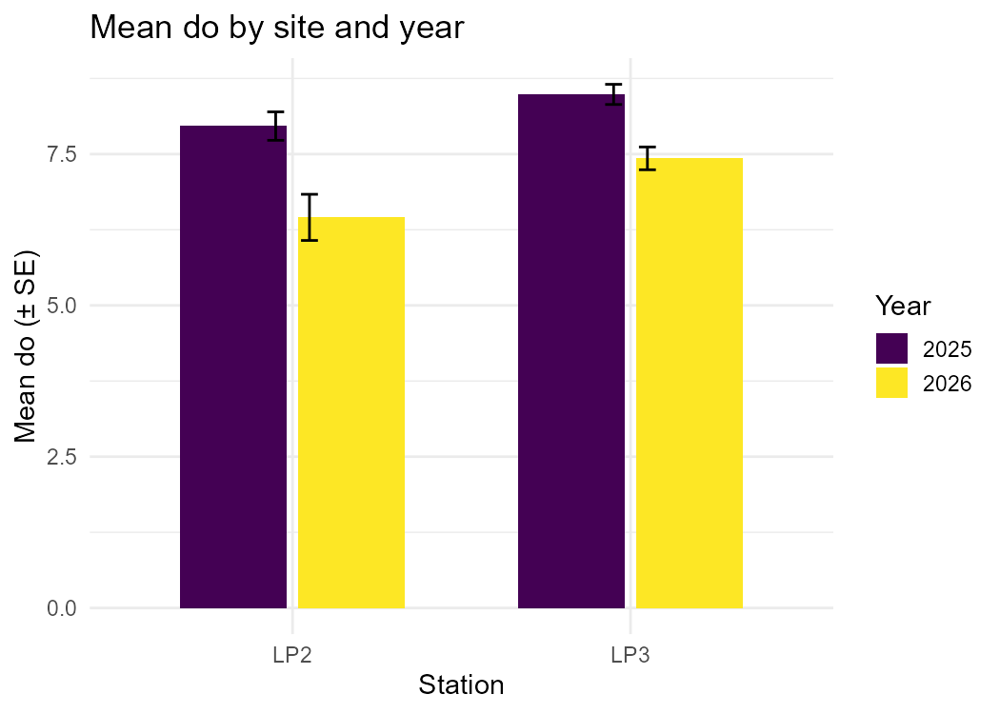
:::

::: {.column width="50%"}
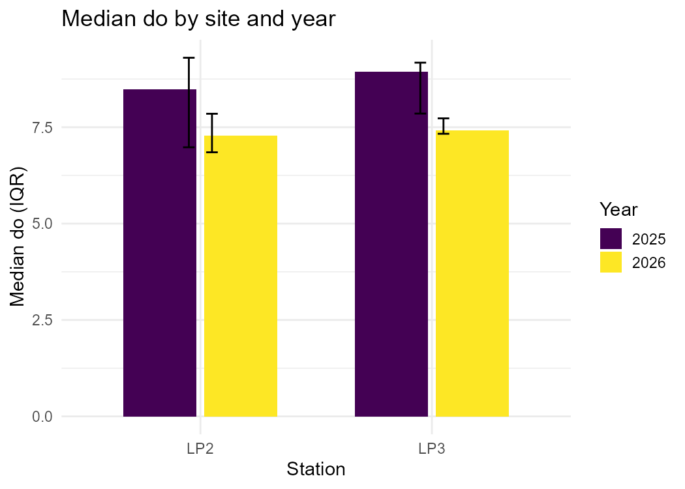
:::
:::::

## Chlorophyll-a — depth profile

::::: columns
::: {.column width="50%"}
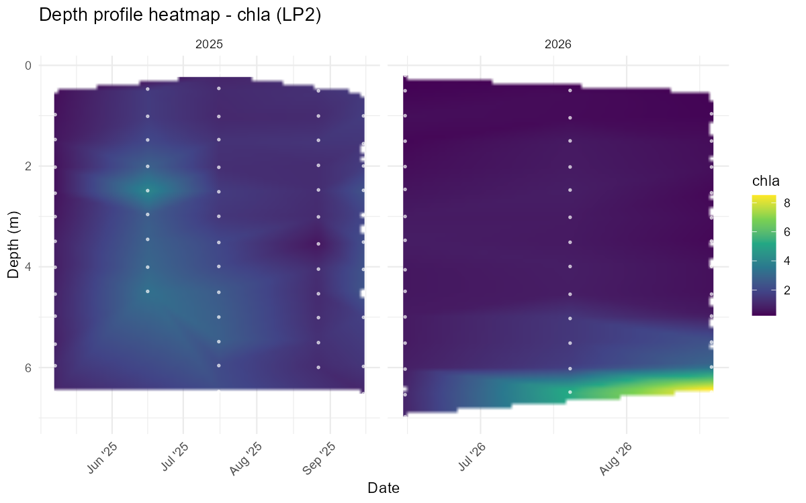
:::

::: {.column width="50%"}
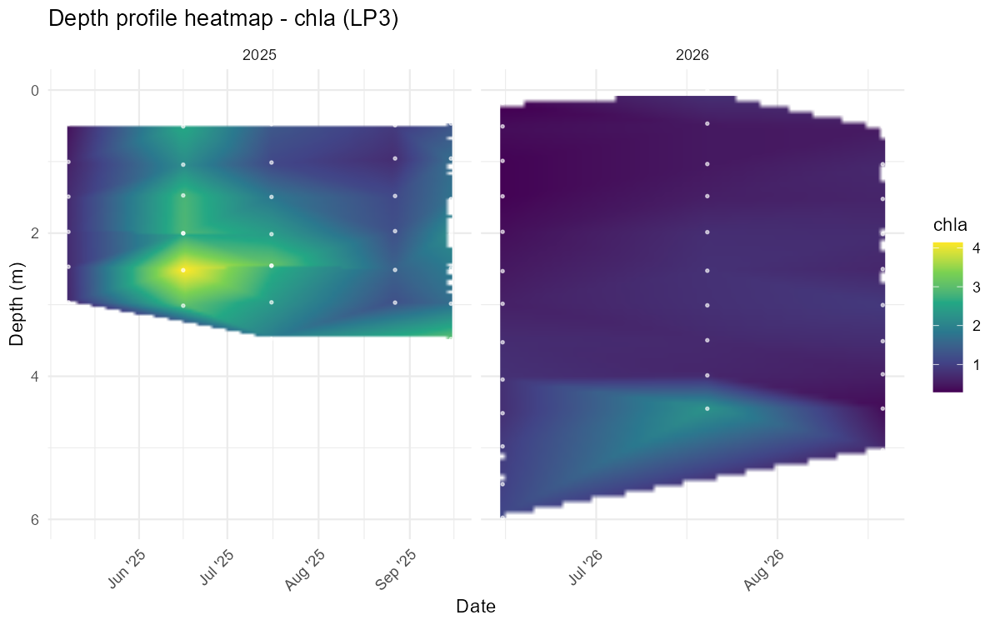
:::
:::::

## Chlorophyll-a — summary

::::: columns
::: {.column width="50%"}
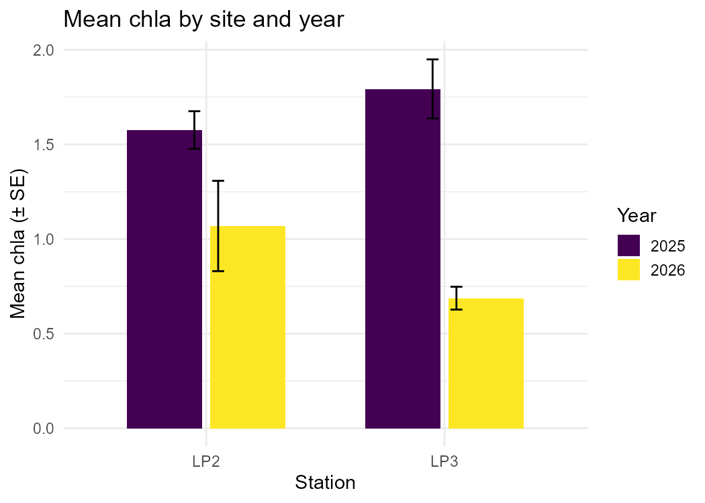
:::

::: {.column width="50%"}
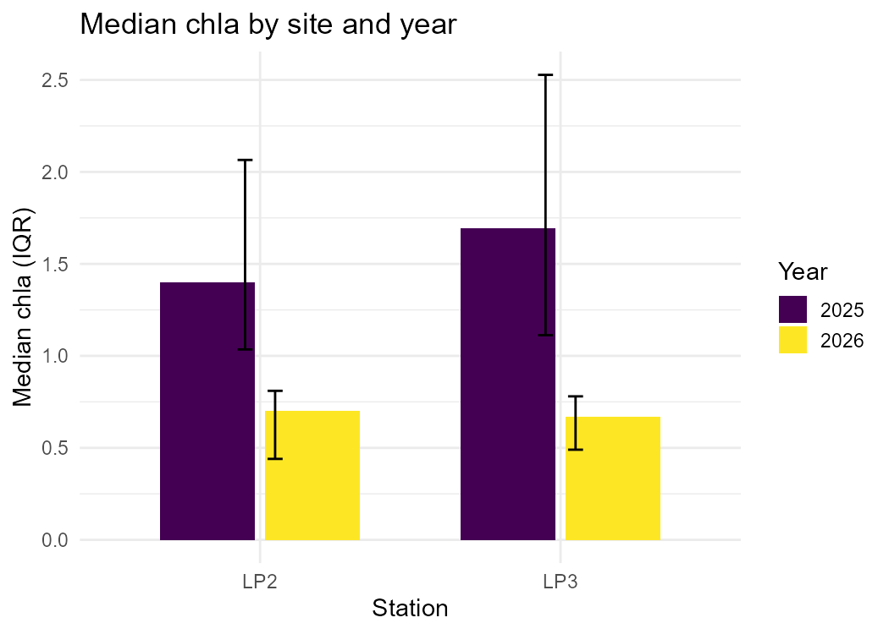
:::
:::::

## Specific conductance

::::: columns
::: {.column width="50%"}
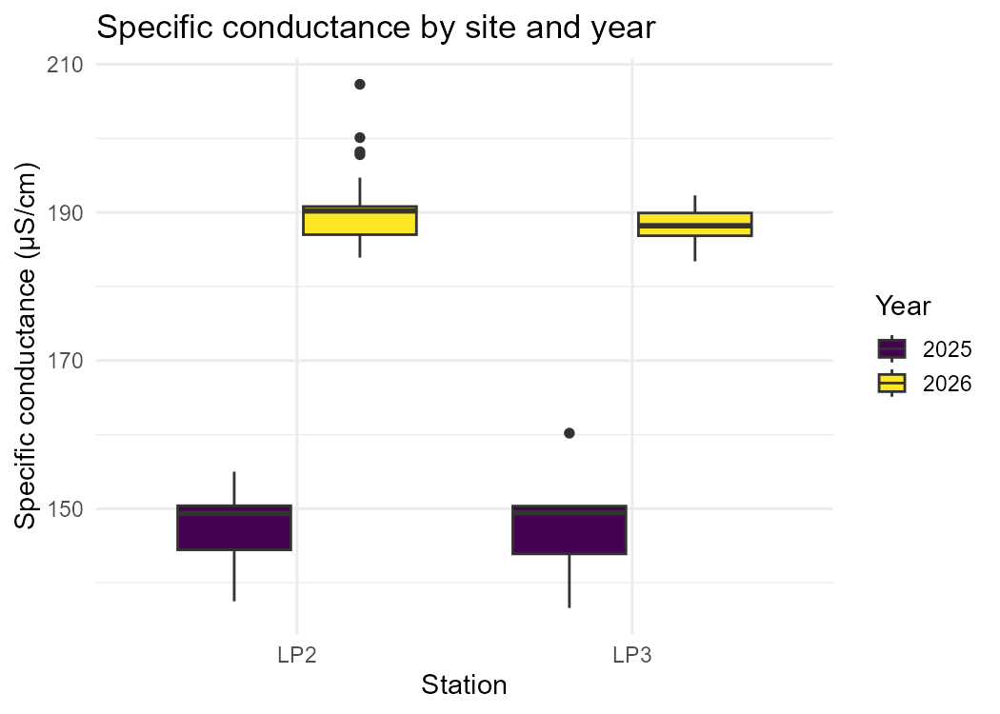
:::

::: {.column width="50%"}
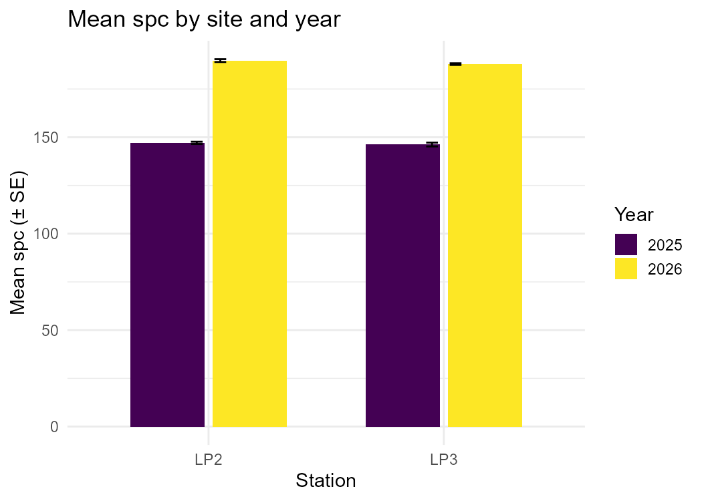
:::
:::::

## Summary and takeaways

- Temperature and specific conductance increased from 2025 to 2026 at both LP2 and LP3.
- Dissolved oxygen and chlorophyll-a decreased from 2025 to 2026 at both sites.
- After correcting for multiple comparisons (two-way ANOVA, station x year), only the specific conductance increase was statistically significant (p \< 0.001); the DO and chlorophyll-a decreases were not significant given the limited sample size.
- No significant differences between LP2 and LP3, and no site x year interaction — where a year effect exists, it appears consistent across sites.
- One LP3 sensor cast on 2026-07-20 produced clearly implausible pH and specific conductance readings and was excluded from the relevant analyses.
- For 2027: consider reinstating LP1 monitoring, restoring the full May–September sampling window, and checking pH sensor calibration.
